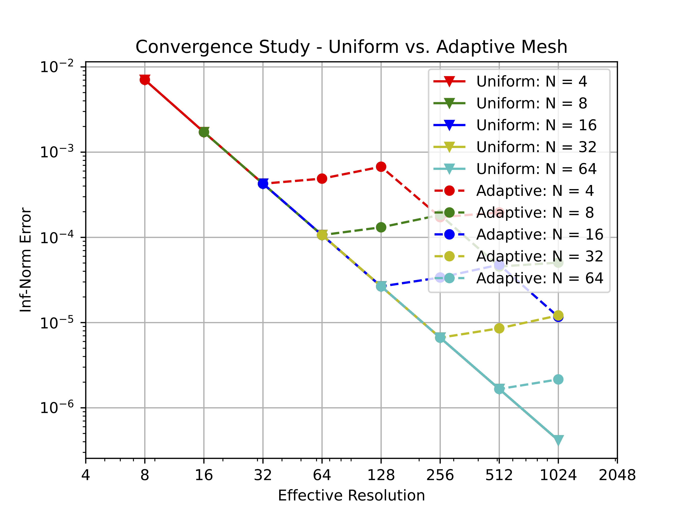
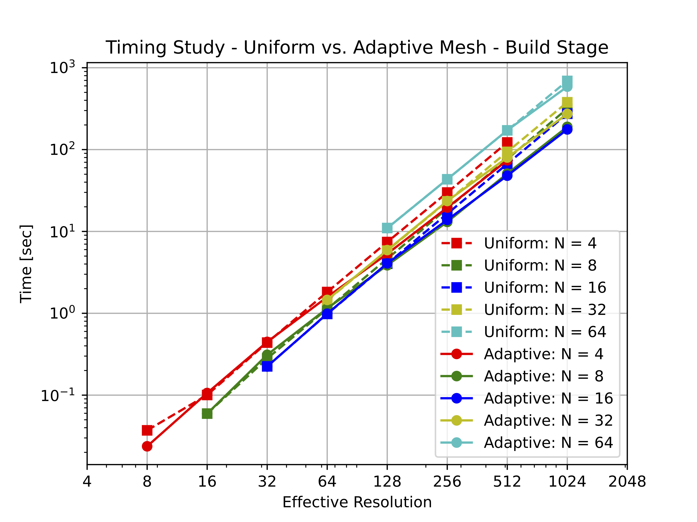
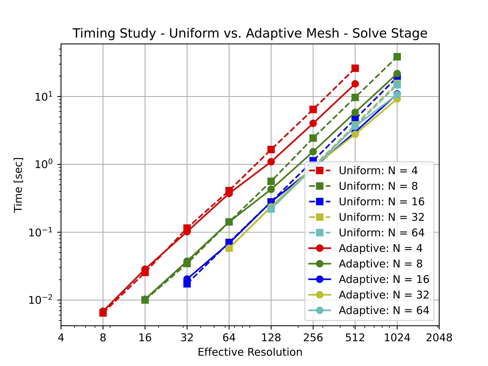

# EllipticForest Examples

## Poisson

Solves Poisson's equation:

$$\Delta u  = f$$

subject to Dirichlet boundary conditions provided by the exact solution.

By default, this is set to solve for the exact solution:

$$u(x,y) = sin(x) + sin(y)$$

thus,

$$f(x,y) = -sin(x) - sin(y) = -u(x,y).$$

In this example, we run a convergence analysis by solving via the HPS method with varying
levels of refinement and patch size. If configured with `matplotlibcpp`, then the error, build,
and solve time plots will be shown.

## Usage

```Bash
./poisson
```

## Output






