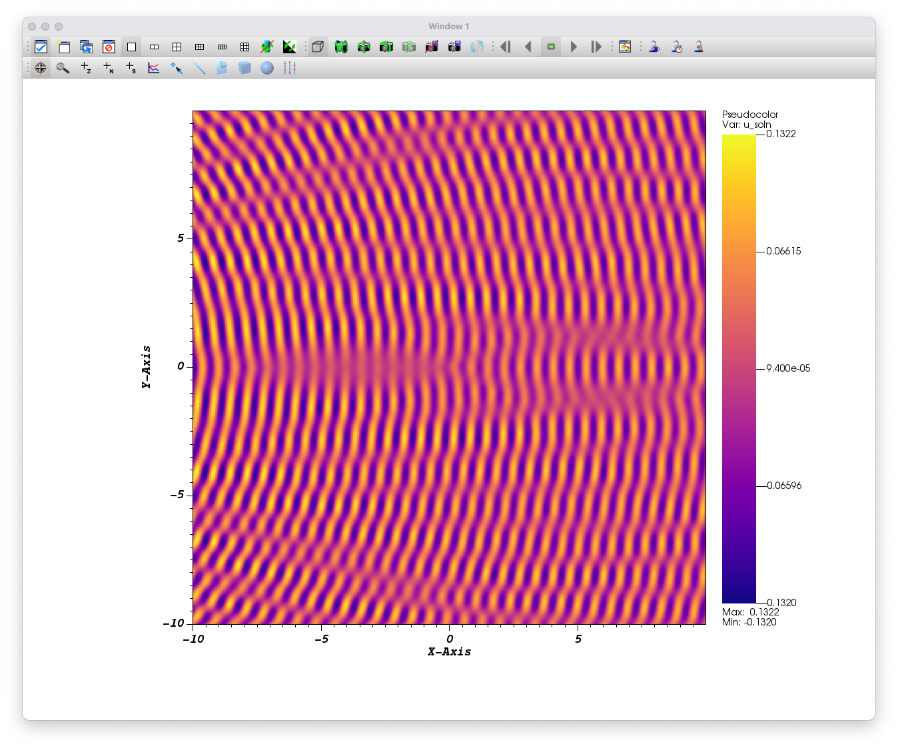

# EllipticForest Examples

## Helmholtz

Solves a Helmholtz equation

$$\Delta u + \lambda u = f$$

subject to Dirichlet boundary conditions provided by the exact solution.

Due to the highly oscillatory nature of this problem, there is no adaptive refinement. This problem is solved on a uniformly refined mesh.

## Usage

```Bash
mpirun -n <number_of_processes> ./helmholtz <min-level> <max-level> <nx> <ny>
```

## Output

