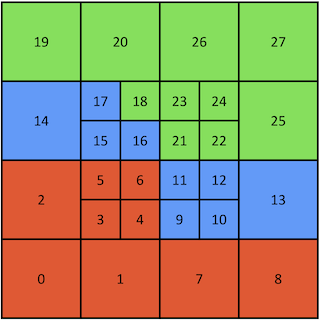

# Summary

EllipticForest is a software library with utilities to solve elliptic partial differential equations (PDEs) with adaptive mesh refinement (AMR) using a direct matrix factorization. It implements a quadtree-adaptive variation of the Hierarchical Poincaré-Steklov (HPS) method [@gillman2014direct]. The HPS method is a direct method for solving elliptic PDEs based on the recursive merging of Poincaré-Steklov operators [@quarteroni1991theory]. EllipticForest is built on top of the parallel and highly efficient mesh library `p4est` [@burstedde2011p4est] for mesh adaptivity and mesh management. Distributed memory parallelism is implemented through the Message Passing Interface (MPI) [@walker1996mpi], which is a first for the HPS method. EllipticForest implements fast, cyclic-reduction methods as found in the FISHPACK [@swarztrauber1999fishpack] library and updated in the FISHPACK90 [@adams2016fishpack90] code. In addition, for more general elliptic problems, EllipticForest wraps solvers from the PDE solver library PETSc [@anl2023petsc]. A key feature of EllipticForest is the ability for users to extend the solver interface classes to implement custom solvers on leaf patches. EllipticForest is the first implementation of the HPS method as a software library to be used either as a standalone to solve elliptic PDEs or for coupling with other scientific libraries for broader applications.

Elliptic PDEs arise in a wide-range of physics and engineering application spaces, including fluid modeling, electromagnetism, astrophysics, heat transfer, and more. Solving elliptic PDEs is often one of the most computationally expensive steps in numerical algorithms due to the need to solve large systems of equations. Parallel algorithms are desirable in order solve larger systems at scale on small to large computing clusters. Communication patterns for elliptic solvers makes implementing parallel solvers difficult due to to the global nature of the underlying mathematics. Further complicating implementations of effective solvers, adaptive mesh refinement adds coarse-fine interfaces and more complex meshes that make development and scalability difficult. The solvers implemented in EllipticForest address these complexities through proven numerical methods and efficient software implementations.

The general form of elliptic PDEs that EllipticForest is tailored to solve is the following:

$$
\alpha(x,y) \nabla \cdot \Big[ \beta(x,y) \nabla u(x,y) \Big] + \lambda(x,y) u(x,y) = f(x,y)
$$

where $\alpha(x,y)$, $\beta(x,y)$, $\lambda(x,y)$, and $f(x,y)$ are known functions in $x$ and $y$ and the goal is to solve for $u(x,y)$. Currently, EllipticForest solves the above problem in a rectangular domain $\Omega = [x_L, x_U] \times [y_L, y_U]$. The above PDE is discretized using a finite-volume approach using a standard five-point stencil yielding a second-order accurate solution. This leads to a standard linear system of equations of the form

$$
\textbf{A} \textbf{u} = \textbf{f}
$$

which is solved via the HPS method, a direct matrix factorization method.

Similar to other direct methods, the HPS method is comprised of two stages: a build stage and a solve stage. In the build stage, a set of solution operators are formed that act as the factorization of the system matrix corresponding to the discretization stencil. In the solve stage, the factorization is applied to a right-hand side vector corresponding to boundary and non-homogeneous data to solve the problem with linear complexity $\mathcal{O}(N)$ where $N$ is the size of the system matrix. The advantages of this approach over iterative methods such as conjugate gradient and multi-grid methods include the ability to apply the factorization to multiple right-hand sides.

# Statement of need

The novelty of EllipticForest as software is the implementation of the HPS method for coupling with other scientific software as well as user extension. Currently, all other implementations of the HPS method are MATLAB codes designed by research groups and used in-house for solving specific problems [@ultraSEM; @HPS_Demos]. EllipticForest is the first C++ implementation of the HPS method. The numerical methods used in EllipticForest are detailed in [TODO: Cite paper 1] and the parallel counterpart in [TODO: Cite paper 2]. This paper highlights the software implementation including the user-friend interface to the HPS method and the ability for users to extend the solver interface using object-oriented programming (OOP) paradigms.

# Software Overview

[TODO]

# References