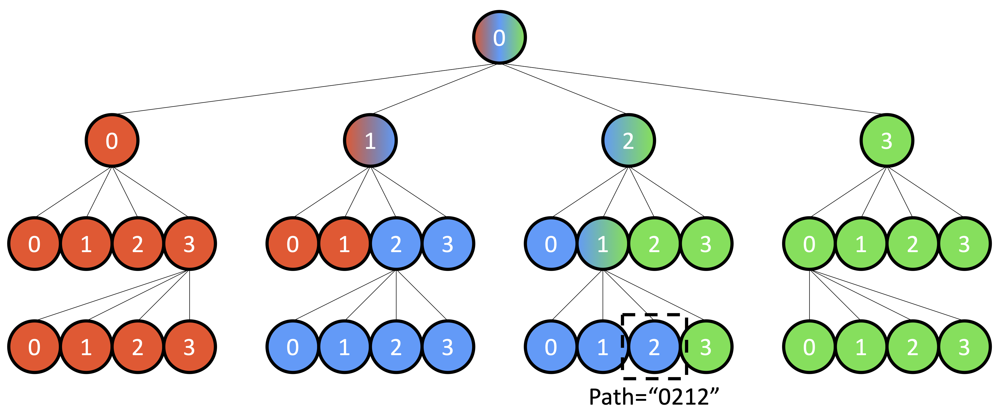
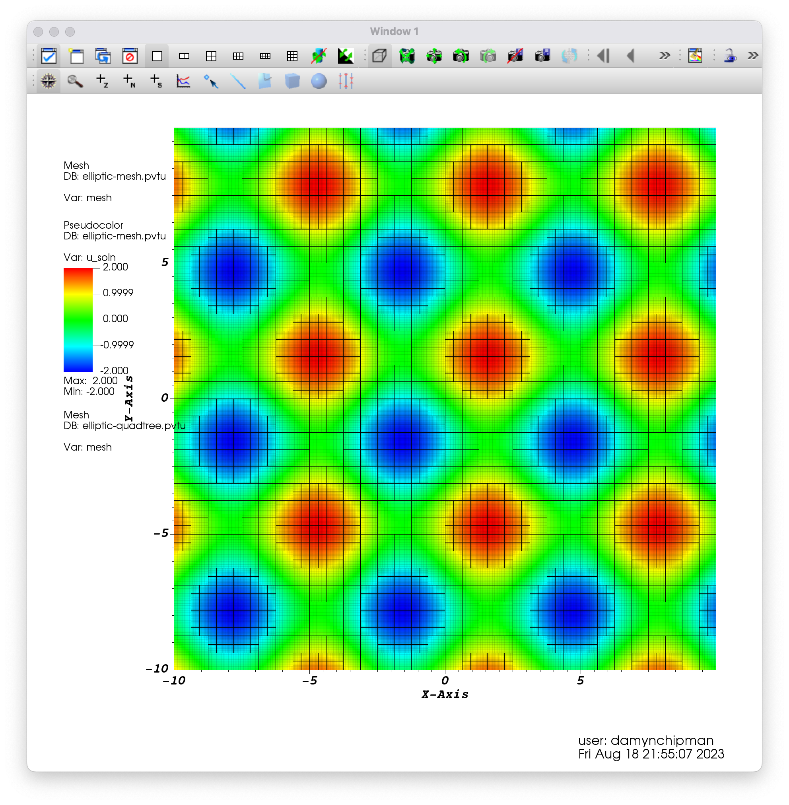

# Summary

EllipticForest is a software library with utilities to solve elliptic partial differential equations (PDEs) with adaptive mesh refinement (AMR) using a direct matrix factorization. It implements a quadtree-adaptive variation of the Hierarchical Poincaré-Steklov (HPS) method [@gillman2014direct]. The HPS method is a direct method for solving elliptic PDEs based on the recursive merging of Poincaré-Steklov operators [@quarteroni1991theory]. EllipticForest is built on top of the parallel and highly efficient mesh library `p4est` [@burstedde2011p4est] for mesh adaptivity and mesh management. Distributed memory parallelism is implemented through the Message Passing Interface (MPI) [@walker1996mpi], which is a first for the HPS method. EllipticForest implements fast, cyclic-reduction methods as found in the FISHPACK [@swarztrauber1999fishpack] library and updated in the FISHPACK90 [@adams2016fishpack90] code. In addition, for more general elliptic problems, EllipticForest wraps solvers from the PDE solver library PETSc [@anl2023petsc]. The numerical methods used in EllipticForest are detailed in [@chipman2024serial] and the parallel counterpart in [@chipman2024parallel]. A key feature of EllipticForest is the ability for users to extend the solver interface classes to implement custom solvers on leaf patches. EllipticForest is the first implementation of the HPS method as a software library to be used either as a standalone to solve elliptic PDEs or for coupling with other scientific libraries for broader applications.

Elliptic PDEs arise in a wide-range of physics and engineering application spaces, including fluid modeling, electromagnetism, astrophysics, heat transfer, and more. Solving elliptic PDEs is often one of the most computationally expensive steps in numerical algorithms due to the need to solve large systems of equations. Parallel algorithms are desirable in order solve larger systems at scale on small to large computing clusters. Communication patterns for elliptic solvers makes implementing parallel solvers difficult due to to the global nature of the underlying mathematics. Further complicating implementations of effective solvers, adaptive mesh refinement adds coarse-fine interfaces and more complex meshes that make development and scalability difficult. The solvers implemented in EllipticForest address these complexities through proven numerical methods and efficient software implementations.

The general form of elliptic PDEs that EllipticForest is tailored to solve is the following:

$$
\alpha(x,y) \nabla \cdot \Big[ \beta(x,y) \nabla u(x,y) \Big] + \lambda(x,y) u(x,y) = f(x,y)
$$

where $\alpha(x,y)$, $\beta(x,y)$, $\lambda(x,y)$, and $f(x,y)$ are known functions in $x$ and $y$ and the goal is to solve for $u(x,y)$. Currently, EllipticForest solves the above problem in a rectangular domain $\Omega = [x_L, x_U] \times [y_L, y_U]$. The above PDE is discretized using a finite-volume approach using a standard five-point stencil yielding a second-order accurate solution. This leads to a standard linear system of equations of the form

$$
\textbf{A} \textbf{u} = \textbf{f}
$$

which is solved via the HPS method, a direct matrix factorization method.

Similar to other direct methods, the HPS method is comprised of two stages: a build stage and a solve stage. In the build stage, a set of solution operators are formed that act as the factorization of the system matrix corresponding to the discretization stencil. In the solve stage, the factorization is applied to a right-hand side vector corresponding to boundary and non-homogeneous data to solve the problem with linear complexity $\mathcal{O}(N)$ where $N$ is the size of the system matrix. The advantages of this approach over iterative methods such as conjugate gradient and multi-grid methods include the ability to apply the factorization to multiple right-hand sides.

# Statement of Need

The novelty of EllipticForest as software is the implementation of the HPS method for coupling with other scientific software as well as user extension. Currently, all other implementations of the HPS method are MATLAB or Python codes designed by research groups and used in-house for solving specific problems [@ultraSEM; @HPS_Demos; @Streamer_HPS]. EllipticForest is the first C++ implementation of the HPS method. This paper highlights the software implementation including the user-friendly interface to the HPS method and the ability for users to extend the solver interface using modern object-oriented programming (OOP) paradigms.

# Software Overview

Below, we outline various components of the software implemented in EllipticForest. These classes and utilities allow the user to create and refine meshes tailored for their use case, initialize the solver for the elliptic PDE, and visualize the output solution. A user may also extend the functionality of EllipticForest through inheritance of the `Patch` classes for user-defined solvers at the leaf level.

## Quadtree

The underlying data structure that encodes the mesh is a path-indexed quadtree. The `Quadtree` object is a class that implements a path-indexed quadtree using a `NodeMap`, which is equivalent to `std::map<std::string, Node<T>*>`. The template parameter `T` refers to the type of data that is stored on quadtree nodes. The `Quadtree` implemented in EllipticForest wraps the `p4est` leaf-indexed quadtree to create, iterate, and operate on the path-indexed quadtree. Functions to iterate over the quadtree include `traversePreOrder`, `traversePostOrder`, `merge`, and `split`. The `traversePreOrder` and `traversePostOrder` functions iterate over the tree in a pre- and post-order fashion, respectively, and provide the user with access to the node or node data via a provided callback function. The `merge` and `split` functions iterate over the tree in a post- and pre-order fashion, respectively, and provide the user with access to a family of nodes, or a group of four siblings and their parent node.

## Mesh

The user interfaces with the domain discretization through the `Mesh` class. The `Mesh` class has an instance of the `Quadtree` detailed above. `Mesh` provides functions to iterate over patches or cells via `iteratePatches` or `iterateCells`.

`Mesh` also provides the user with an interface to the visualization features of EllipticForest. A user may add mesh functions via `addMeshFunction`, which are functions in $x$ and $y$ that are defined over the entire mesh. This can either be a mathematical function $f(x,y)$ that is provided via a `std::function<double(double x, double y)>`, or as a `Vector<double>` that has the value of $f(x,y)$ at each cell in the domain, ordered by patch and then by the ordering of patch grid. Once a mesh function is added to the mesh, the user may call `toVTK`, which writes the mesh to a parallel, unstructured VTK file format. See the section below on output and visualization for more information.

## Patches

The fundamental building block of the mesh and quadtree structures are the patches. A `Patch` is a class that contains data matrices and vectors that store the solution data and operators needed in the HPS method. A `Patch` also has an instance of a `PatchGrid` which represents the discretization of the problem. Each node in the path-indexed quadtree stores a pointer to a `Patch`.

In EllipticForest, the patch, patch grid, patch solver, and patch node factory interfaces are implemented as a pure virtual interface for the user to extend. Internally, EllipticForest uses these interfaces to call the implemented solver or discretization. By default, EllipticForest implements a 2nd-order, finite volume discretization and solver. This implementation is found under `src/Patches/FiniteVolume` and each class therein implements the pure virtual interface of the `Patch`, `PatchGrid`, `PatchSolver`, and `AbstractNodeFactory` classes. Users may use the finite volume implementation shipped with EllipticForest, or they may implement different solvers to be used in the HPS method.

## HPS Solver

Once the mesh has been created and refined, and the patch solver has been initialized, solving the elliptic problem on the input mesh is done by creating an instance of the `HPSAlgorithm` class. The `HPSAlgorithm` class has member functions that perform the setup, build, upwards, and solve stages of the HPS method. As the HPS method is a direct method, once the build stage has been completed, the upwards and solve stages can be called without rebuilding the matrix factorization.

## Output and Visualization

Once the problem has been solved over the entire mesh, each leaf patch in the mesh has the solution stored in one of it's data vectors, `vectorU`. This is a discrete representation of the solution to the PDE.

The user may choose to output the mesh and solution in an unstructured PVTK format using the VTK functionality built-in. To output to VTK files, the user first adds mesh functions to the mesh. This includes the solution stored in `vectorU` after the HPS solve. Then, the user calls the `toVTK` member function of the `Mesh` class. This will write a `.pvtu` file for the mesh and a `.pvtu` file for the quadtree. An example of this output for a Poisson equation is shown in \autoref{fig:poisson_solution}.

# References